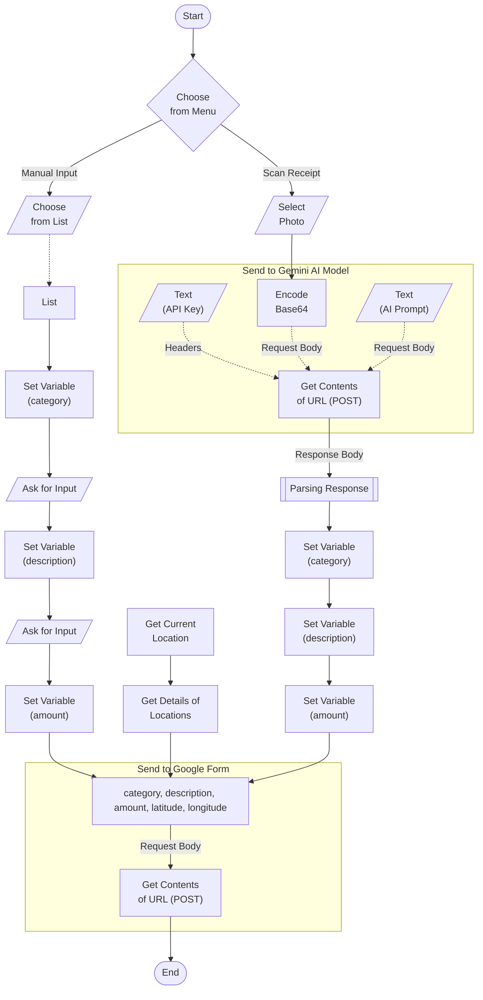
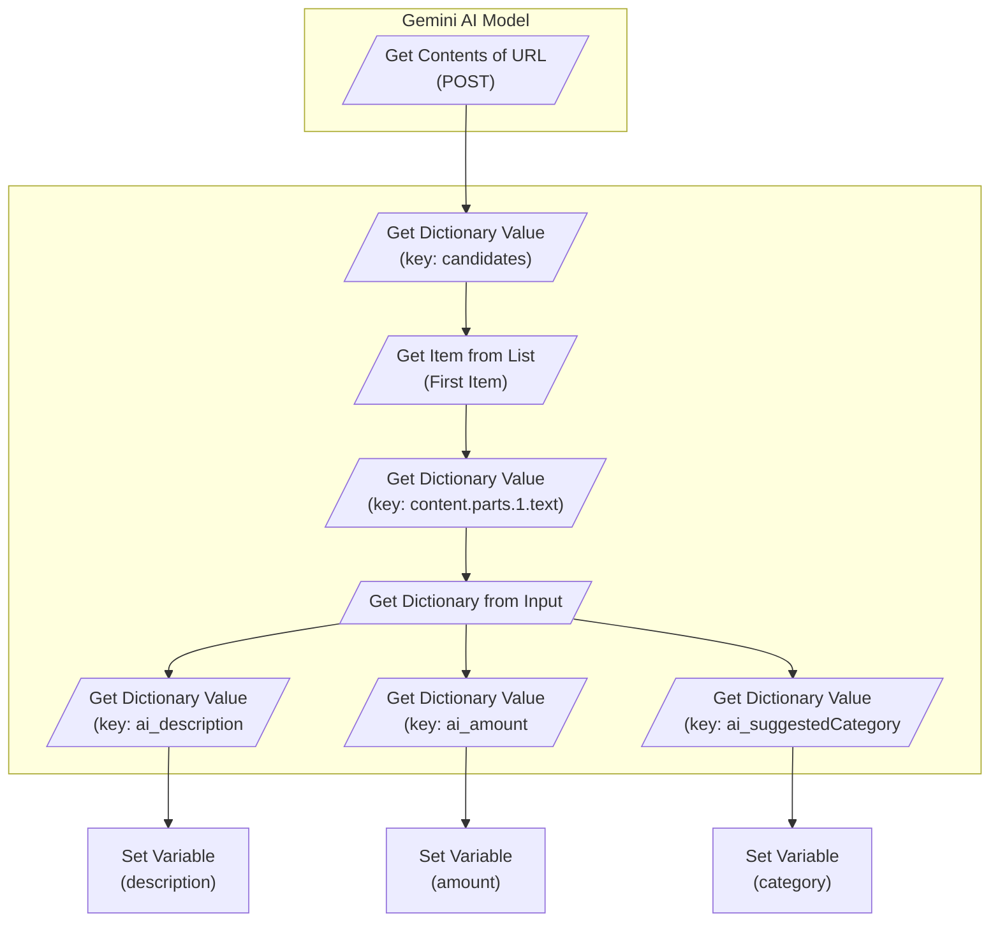
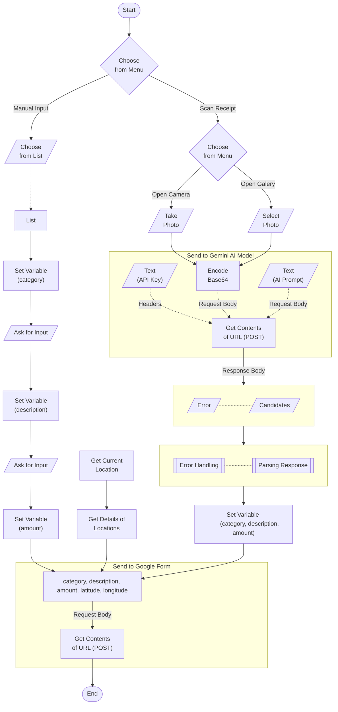

## Level 1 - Basic
This stage covers initial setup and foundational knowledge you need to get started 🚀.

### Create a Google Form
1. Go to https://docs.google.com/forms/u/0/.
2. Choose _Blank Form_ and rename to `Catatan Keuangan Harian`.
3. Leave _Form description_ blank.
4. Rename _Untitled Question_ to `Kategori` and change to _Short answer_.
5. Click _Copy_ icon to _Duplicate Question_ and rename to `Deskripsi`.
6. Click _Copy_ icon to _Duplicate Question_ and rename to `Nominal`. Click _Triple dots_ icon and choose _Response validation_. Choose _Number_ and _Is number_.
7. Move to _Responses_ Tab and click _Link to Sheets_. Stay on _Create a new spreadsheet_ option and rename to `Catatan Keuangan Harian`. Click _Create_.
8. Click _Publish_ button. Click _Publish_ button again.
9. Click _Triple dots_ icon on the right side of _Published_ button and choose _Pre-fill form_. Fill the form with the random values and click the _Get link_ button.
10. Click the _COPY LINK_ button on the bottom pop-up later on. Paste it somewhere:

For example, here is the clipboard (your <u>Form ID</u> maybe different):
<pre><code>https://docs.google.com/forms/d/e/<u>1FAIpQLSfgd-AefHbwUojiaFUEnrnMSWaeXqMxoumpn40CALxNksfC5g</u>/viewform?usp=pp_url&entry.108078765=food&entry.799982393=satay&entry.778257956=25000</code></pre>

so the _`Form URL`_ will look like this:
<pre><code>https://docs.google.com/forms/d/e/<u>1FAIpQLSfgd-AefHbwUojiaFUEnrnMSWaeXqMxoumpn40CALxNksfC5g</u>/<b>formResponse</b></code></pre>

also jotted down the entries reflected to our questions (Your _`Entry ID`_ maybe different):

|Question|Type|Response validation|Entry ID|
|:---|:---|:---|:---|
|`Kategori`|Short answer| |`entry.108078765`|
|`Deskripsi`|Short answer| |`entry.799982393`|
|`Nominal`|Short answer|Number; Is number; Custom error text|`entry.778257956`|

### Create an iOS Shortcut
1. Open _Shortcuts_ app in iPhone. Tap _+_ to create a new shortcut. Rename _New Shortcut_ to `Catatan Keuangan Harian`.
2. In _Search Actions_ bar, find and choose _Ask for Input_. Fill _Prompt_ with `Kategori?`. Tap _Chevron_ icon and untick _Allow Multiple Line_ option.
3. Tap _Ask for Input_ icon action and choose _Duplicate_. Rename it into `Deskripsi?`.
4. Duplicate once more. Tap _Text_ and choose _Number_. Rename it into `Nominal?`.
5. Tap _Chevron_ icon and untick _Allow Decimal Numbers_ and _Allow Negative Numbers_ options.
6. In _Search Actions_ bar, find and choose _Get contents of URL_. Fill _URL_ with the _`Form URL`_ then tap _Chevron_ icon.
7. Tap _GET_ and change the _Method_ into `POST`. Tap _JSON_ and change the _Request Body_ into `Form`.
8. Tap _Add new field_ and choose _Text_. Fill _Key_ with _`Entry ID`_. Repeat for all _`Entry ID`_.
9. Tap _Text_ on each field and choose _Select Variable_. Swipe up and select _Ask for Input_, matching it accordingly.
10. Tap _Add new field_ and choose _Text_. Fill _Key_ with `submit` and _Text_ with `Submit`.

For the first time, pop-up will be shown to ask permission for accessing the _`form URL`_. Simply choose _Always Allow_.

## Level 2 - Aware
This stage adds context to your data. Now we don't just track what you spent, but also where you spent it 👁️.

### Update the Google Form
1. Go to https://docs.google.com/forms/u/0/.
2. Open `Catatan Keuangan Harian` form and click _Amount_ question. Click _Copy_ icon twice to _Duplicate Question_ two times.
3. Rename the duplicated questions to each `Longitude` and `Latitude` respectively.
4. Click _Triple dots_ icon on the right side of _Published_ button and choose _Pre-fill form_. Fill the form with the random values and click the _Get link_ button.
5. Click the _COPY LINK_ button on the bottom pop-up later on. Paste it somewhere:

Take a look only for the new _`Entry ID`_:
<pre><code>https://docs.google.com/forms/d/e/<u>1FAIpQLSfgd-AefHbwUojiaFUEnrnMSWaeXqMxoumpn40CALxNksfC5g</u>/viewform?usp=pp_url&entry.108078765=food&entry.799982393=satay&entry.778257956=25000&<b>entry.214181402</b>=-1.5&<b>entry.714053152</b>=1.5</code></pre>

|Question|Type|Response validation|Entry ID|
|:---|:---|:---|:---|
|`Latitude`|Short answer|Number; Is number; Custom error text|`entry.214181402`|
|`Longitude`|Short answer|Number; Is number; Custom error text|`entry.714053152`|

### Update the iOS Shortcut

1. In _Search Actions_ bar, find and choose _Get Current Location_.
2. In _Search Actions_ bar, find and choose _Get Details of Locations_. Tap _Detail_ and choose `Latitude`.
3. Tap _Get Details of Locations_ icon and choose _Duplicate_. Tap _Latitude_ and change it to `Longitude`.
4. Tap and hold _Get contents of URL_ action then drag it to the very bottom. Next, Tap _Chevron_ icon.
5. Tap _Add new field_ and choose _Text_. Fill _Key_ with the new _`Entry ID`_. Repeat for all new _`Entry ID`_.
6. Tap _Text_ on each field and choose _Select Variable_. Swipe up and choose `Longitude` and `Latitude` respectively.
7. Tap and hold _Hamburger_ icon on `submit` field then drag it to the very bottom.

## Level 3 - Organized
This stage makes your data cleaner and your shortcut smarter. No more random in `Kategori` and let's start make things tidy and programmatic 🎯.

### Update the iOS Shortcut
1. In _Search Actions_ bar, find and choose _List_.
2. Change _One_ to `🍱🍜 Makan/Minum` and change _Two_ to `🥤🍩 Jajan`.
3. Tap _Add New Item_ and fill _Text_ to `🛒🍎 Belanja`. Continue for the rest or feel free to adjust as needed. 
4. Tap and hold _List_ action then drag it to the very top.
5. In _Search Actions_ bar, find and choose _Choose from List_. Tap and hold then drag it to down below the _List_ action.
6. Tap _Chevron_ icon and fill _Prompt_ with `Kategori?` and remove _Ask for Input_ action for the `Kategori?` we've created previously.
7. In _Search Actions_ bar, find and choose _Set Variable_. Tap and hold then drag it to down below the _Choose from List_ action. Fill `Variable Name` with `category`.
8. In _Search Actions_ bar, find and choose _Set Variable_. Tap and hold then drag it to down below the _Ask for Input_ action for `Deskripsi?`. Fill `Variable Name` with `description`.
9. In _Search Actions_ bar, find and choose _Set Variable_. Tap and hold then drag it to down below the _Ask for Input_ action for `Nominal?`. Fill `Variable Name` with `amount`.
10. Go to the _Get contents of URL_ action and tap _Chevron_ icon. You'll notice the `Kategori?` value field within _Request Body_ turn into red.
11. Tap on it and click _Clear variable_. Tap _Text_ and click _Select Variable_. Swipe up and choose `category` variable.
12. Do the same for the two next fields for clear the previous variables and choose our newly created variables, `description` and `amount`.

For the first time, pop-up will be shown to ask permission for accessing our current loction. Simply choose _Always Allow_.

### Full Category List
|No.|Category|Examples|
|:--|:-------|:-------|
|1.|🍱🍜 Makan/Minum|warung, resto, food delivery, nasi padang|
|2.|🥤🍩 Jajan|boba, donut, snack, cafe ringan, bakery|
|3.|🛒🍎 Belanja|raw groceries: sayur, daging, bumbu, beras|
|4.|🧴🪥 Rumah Tangga|sabun, odol, deterjen, tissue, perlengkapan rumah|
|5.|📶🛜 Tagihan|PLN, PDAM, Indihome, pulsa, BPJS|
|6.|🚗⛽ Transport|bensin, ojol, parking, tol, tiket|
|7.|🎬🎮 Hiburan|Spotify, Netflix, Vidio, bioskop, game|
|8.|👕👟 Fashion|baju, sepatu, salon, skincare premium, parfum|
|9.|💊💪🏻 Kesehatan|apotek, dokter, vitamin, gym, klinik|
|10.|🧠📚 Level Up|course, buku, sertifikasi, ChatGPT, Udemy|
|11.|🎁💌 Sosial|hadiah, kondangan, sumbangan, kasih ortu|
|12.|💰📈 Finansial|cicilan, asuransi premi, investasi|

## Level 4 - Intelligent
This stage is where AI takes over! Just upload a receipt and let the magic happen 🧠.

### Create a Gemini API Key
1. Go to https://aistudio.google.com/api-keys.
2. At the right top, click _Create API Key_ button.
3. Rename _Gemini API Key_ to something more descriptive.
4. Assign it to a specific project to stay organized.
5. You can also choose _+ Create Project_ directly if you prefer.

The `API Key` will be used later on for the headers value of _x-goog-api-key_ key.

### Highlight
 
**1. Action Flow**



**2. Headers & Request Body Structure**
```text
Headers
├── x-goog-api-key: "AIzaSy...your_api_key"
└── Content-Type: "application/json"
```

```text
Request Body: JSON
├── contents (Array, 1 item)
│   └── [Item 1: Dictionary]
│       └── parts (Array, 2 items)
│           ├── [Item 1: Dictionary - IMAGE]
│           │   └── inline_data (Dictionary)
│           │       ├── mime_type: "image/jpeg"
│           │       └── data: [Base64 Encoded] ← variable
│           └── [Item 2: Dictionary - TEXT]
│               └── text: `"You are a receipt parser..."`
└── generationConfig (Dictionary)
    └── responseMimeType: "application/json"
```

<details>
<summary> Here's the prompt or feel free to adjust as needed.</summary>

```text
You are a receipt parser for Indonesian receipts. Look at the receipt image and return ONLY a valid JSON object.

OUTPUT FORMAT:
{
  "ai_description": "string in Proper Case",
  "ai_amount": number,
  "ai_suggestedCategory": "string"
}

RULES:

1. AMOUNT: Indonesian format, dots/commas are THOUSAND separators (Rp16.000 = 16000). Pick FINAL TOTAL paid (look for "Grand Total" or "Total"). Ignore DPP, PPN, Harga Jual, Subtotal, "Number of Items".

2. DESCRIPTION (MUST be in Proper Case — first letter of each significant word capitalized):
   - Find MERCHANT NAME. Usually at top header, but for small businesses may appear at FOOTER (after "Terima Kasih").
   - IGNORE address/location-only lines (e.g., "Batukajang", "Jakarta Selatan", "Jl. Sudirman").
   - Strip legal prefixes: PT, CV, UD.
   - Format: "Merchant: Item1, Item2 (xN), Item3"
   - For QTY > 1: append "(xN)" after item name.
   - For QTY = 1: write item name ONLY. DO NOT add "(x1)".
   - EXCEPT For FUEL, write item name and its numbers of Liter, add "L (without prefix space)"
   - Convert ALL CAPS items to Proper Case (e.g., "ROTI TAWAR GANDUM" → "Roti Tawar Gandum").
   - Max 120 chars total.
   - If no items, use merchant name only.
   
   Examples:
   - "Julie The Half Plate: Roti Tawar Gandum, Abon Roll (x2), Roti Keju, Snack Bolen Pisang, Roti Pisang (x2), Box Medium"
   - "Indomaret: Aqua (x3), Sabun, Tissue (x2)"
   - "Solusi Mart QRIS BNI"

3. SUGGESTED_CATEGORY must be EXACTLY one of (case-sensitive):
   Makan/Minum (warung, resto, food delivery, nasi padang)
   Jajan (boba, donut, snack, cafe ringan, bakery)
   Belanja (raw groceries: sayur, daging, bumbu, beras)
   Rumah Tangga (sabun, odol, deterjen, tissue, perlengkapan rumah)
   Tagihan (PLN, PDAM, Indihome, pulsa, BPJS)
   Transport (bensin, ojol, parking, tol, tiket)
   Hiburan (Spotify, Netflix, Vidio, bioskop, game, konser)
   Fashion (baju, sepatu, salon, skincare premium, parfum)
   Kesehatan (apotek, dokter, vitamin, gym, klinik)
   Level Up (course, buku, sertifikasi, ChatGPT, Udemy)
   Sosial (hadiah, kondangan, sumbangan, kasih ortu)
   Finansial (cicilan, asuransi premi, investasi)

4. PRIORITY RULES (if ambiguous):
   - Premium personal care (>Rp100K, aesthetic-driven) → Fashion
   - Basic hygiene (<Rp100K, daily use) → Rumah Tangga
   - Streaming subscription → Hiburan (not Tagihan)
   - AI/productivity tools (ChatGPT, Claude) → Level Up
   - One-time course/exam → Level Up
   - BPJS / mandatory insurance → Tagihan
   - Optional insurance/investment → Finansial
   - Bensin + minor item (e.g., aqua) → Transport (dominant cost rule)
   - Convenience store mostly food → Belanja
   - Convenience store mostly toiletries → Rumah Tangga
   - Bakery/cake shop → Jajan

5. Use null if cannot extract.
```
</details>

<br>

**3. Parsing Response**


## Level 5 - PRO!
This stage unlocks direct camera scanning and resilient error handling. Congratulations, King 👑.

### Highlight 

**1. Action Flow**

